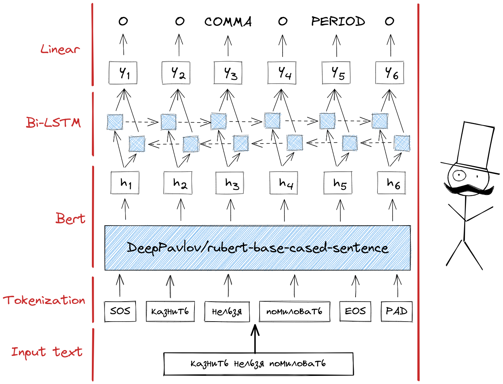

# Neuro-comma

This library was developed with the idea to help us to create punctuation restoration models to memorize trained parameters, data, training visualization, etc. The Library doesn't use any high-level frameworks, such as `PyTorch-lightning` or `Keras`, to reduce the level entry threshold.

**Feel free to fork this repo and edit model or dataset classes for your purposes.**

## Prerequirements
 
 - Python 3.9 *for training*
 - Docker *for production*
  
**Why development environment is `Python` 3.9 if production environment in `Dockerfile` is `3.8`?**

 - Our team always uses the latest version and features of `Python`. We started with `Python` 3.9, but realized, that there is [no FastAPI image for Python 3.9](https://hub.docker.com/r/tiangolo/uvicorn-gunicorn-fastapi). There is [several PRs](https://github.com/tiangolo/uvicorn-gunicorn-docker/pulls) in image repositories, but no response from maintainers. So we decided to change code which we use in production to work with the 3.8 version of `Python`. In [some functions](https://github.com/sviperm/neuro-comma/blob/69e4fe6f1d0be343d4fe1ade522d587d51ef7743/src/neuro_comma/utils.py#L10) we have 3.9 code, but we still use them, these functions are needed only for development purposes.

## Installation
 
 - Option 1:
    ```shell
    pip install -U pip wheel setuptools
    ```
    ```shell
    pip install -r requirements.txt
    ```
  - Option 2:
    ```shell
    sh scripts/installation.sh
    ```

## Python module usage
 - Choose model from [releases section](https://github.com/sviperm/neuro-comma/releases)
 - Checkout to release tag!
 - Download and unzip model
 - Check [`quantization.ipynb`](https://github.com/sviperm/neuro-comma/blob/repunct-quant/notebooks/quantization.ipynb) notebook for example how use predictor.


## Production usage
 - Choose model from [releases section](https://github.com/sviperm/neuro-comma/releases)
 - Checkout to release tag!
 - Download and unzip model
 - Run `docker-compose`
    ```shell
    docker-compose up -d
    ```
  - Stop container
    ```shell
    docker-compose down
    ```

## Model training

Model training from scratch:
```shell
python src/train.py \
    --model-name repunct-model \
    --pretrained-model DeepPavlov/rubert-base-cased-sentence \
    --targets O COMMA PERIOD \
    --train-data data/repunct/train \
    --val-data data/repunct/test \
    --test-data data/repunct/test \
    --store-best-weights \
    --epoch 7 \
    --batch-size 4 \
    --augment-rate 0.15 \
    --labml \
    --seed 1 \
    --cuda 
```

Fine-tuning already trained model. Add `--fine-tune` argument, this will load params from `repunct-model` and apply them to training function. This will create new subdirectory with `{model-name}_ft` name in `models/` directory. Source model will be untouched.

```shell
python src/train.py \
    --model-name repunct-model \
    --fine-tune \
    --targets O COMMA PERIOD \
    --train-data data/repunct/train \
    --val-data data/repunct/test \
    --test-data data/repunct/test \
    --store-best-weights \
    --epoch 3 \
    --batch-size 4 \
    --labml \
    --seed 1 \
    --cuda 
```

In some cases you want to resume training (computer crashed, light blinked, etc.). This will resume training from last model checkpoint (saved weight). Just add `--resume` argument.

```shell
python src/train.py \
    --model-name repunct-model \
    --resume \
    --pretrained-model DeepPavlov/rubert-base-cased-sentence \
    --targets O COMMA PERIOD \
    --train-data data/repunct/train \
    --val-data data/repunct/test \
    --test-data data/repunct/test \
    --store-best-weights \
    --epoch 4 \
    --batch-size 4 \
    --augment-rate 0.15 \
    --labml \
    --seed 1 \
    --cuda 
```

More examples [here](https://github.com/sviperm/neuro-comma/tree/master/scripts)

## How it works

Before inserting raw text into model it should be tokenized. Library handle it with [`BaseDataset.parse_tokens`](https://github.com/sviperm/neuro-comma/blob/fc89b977b5e3caf866f54f9e2a0d9503869a8a57/src/neuro_comma/dataset.py#L63)

[Model architecture](https://github.com/sviperm/neuro-comma/blob/fc89b977b5e3caf866f54f9e2a0d9503869a8a57/src/neuro_comma/model.py#L15) is pretty easy and straight forward:
 - BERT layer - [DeepPavlov/rubert-base-cased-sentence](https://huggingface.co/DeepPavlov/rubert-base-cased-sentence) language model
 - Bi-LSTM layer - to reduce demsions
 - Linear layer - final layer to predict what symbol should go after token


## Credits

[Our article on habr.ru](https://habr.com/ru/company/barsgroup/blog/563854/)

This repository contains code (which was edited for production purposes) from [xashru/punctuation-restoration](https://github.com/xashru/punctuation-restoration).

Special thanks to [@akvarats](https://github.com/akvarats)
